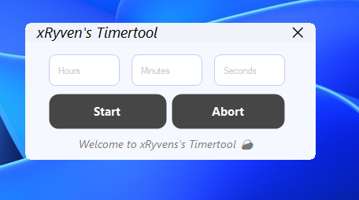

# xRyven's Timer Tool

**Disclaimer:** This tool uses the Windows Command Prompt (`cmd`) to shut down your computer via the `shutdown` command.

## Overview

xRyven's Timer Tool is a simple and easy-to-use Windows application that allows you to schedule your computer to shut down after a specified amount of time. It features a clean design and straightforward interface.

## Features

- Shutdown your computer after a custom time delay.
- Simple and intuitive user interface.
- Modern design using .NET Framework 4.8 and Guna.UI2.

## Installation

1. Download the latest release from the [Releases](https://github.com/yourusername/xRyvenTimerTool/releases) page.
2. Run the `.exe` file directly — no installation required.

## Usage

1. Launch the `xRyvenTimerTool.exe`.
2. Enter the amount of time after which you want your PC to shut down.
3. Start the timer.
4. You can close the program after starting the timer — shutdown will proceed regardless.

## Requirements

- Windows 10 or Windows 11 (tested on Windows 11).
- .NET Framework 4.8 installed.

## Screenshots

## Contributing

Feel free to use this tool however you want, but please don’t steal or claim it as your own.

## License

This project is created and maintained by xRyven. No official license is provided.

## Contact

Find me on all platforms as **xryventv**.

---

*Thank you for checking out the tool!*
